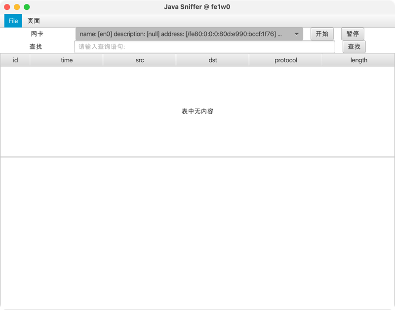

# JSniffer

> 课程作业，自己顺便学习一下JavaFX和Pcap4j

# Introduction
基于JavaFX和Pcap4j的网络嗅探工具，理论上适用多种平台，已在Mac (macos 13.2.1) aarch64上测试使用。

* 主页面

* 启动时

* BPF 过滤器（支持嗅探前、嗅探时、嗅探后三种时态）

* 打开文件

* 保存文件

* 数据统计

## Usage

在网卡下拉栏可以选择网卡，进行选择开启嗅探，或选择打开pcap文件进行分析，也支持保存嗅探得到的数据包。

## Features

- 简明的UI
- 读取和保存 pcap 文件
- 支持嗅探前、嗅探时和嗅探后使用filter过滤
- 简单的数据统计
- 得益于Java Native Access，可以适用多种平台
- UI支持对被选择的packet进行Tree View。

# Logs

- 2023/03/03 0.3 version
- 2023/03/
- 2023/02/28 0.1 version
